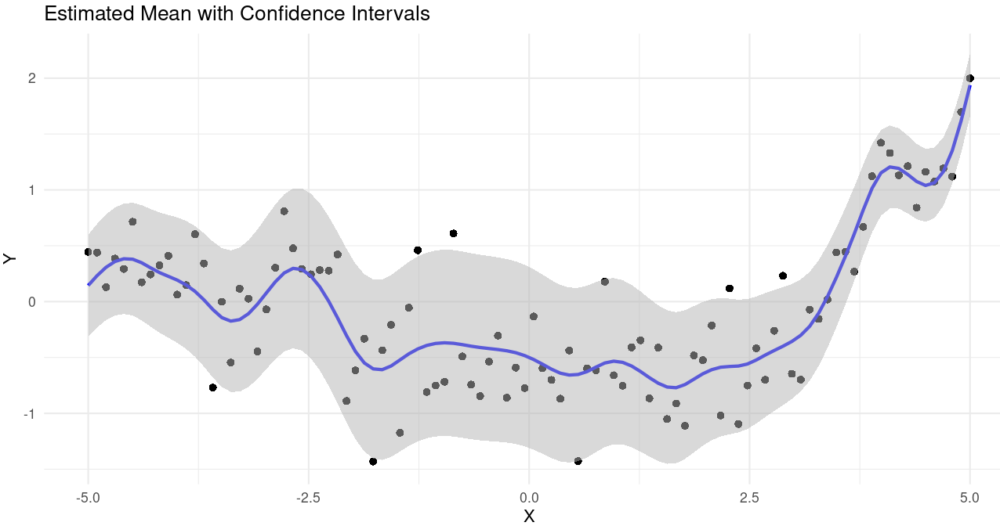

# pSplineLocationScale

> **University Project**: This R package was developed as a term paper for the course "Advanced Statistical Programming with R" at the University of Göttingen, September 2023.

An implementation of penalized B-splines (p-Splines) for location-scale regression using the RS-algorithm for parameter estimation.

## About This Project

This package implements frequentist estimation of non-linear covariate effects using p-Splines in a Gaussian location-scale regression framework. Unlike standard linear models where mean and variance are constant, location-scale models allow both the mean (location) and variance (scale) to vary across the data domain.

## Project Structure

### Core Implementation Files

- **`R/create_splines.r`**: B-spline basis function construction
  - Cox-de-Boor algorithm for computing b-spline basis functions
  - Penalty matrix construction for penalized least squares
  - Design matrix generation

- **`R/rs_algorithm.r`**: RS-Algorithm implementation
  - Outer iteration: alternates between fitting location (μ) and scale (σ) parameters
  - Inner iteration: local scoring algorithm (GLIM-like)
  - Lambda optimization via Generalized Cross Validation (GCV) or Generalized Akaike Information Criterion (GAIC)

- **`R/user_functions.r`**: User-facing API
  - `lmls_bspline()`: Main function for fitting location-scale models
  - `plot_lmls_bspline()`: Visualization with confidence intervals
  - `summary_lmls_bspline()`: Model summary output

- **`R/create_testing_data.R`**: Test data generators
  - Polynomial data with constant/varying variance
  - Fan-shaped data patterns

- **`tests/testthat/`**: Unit tests for all major functions

- **`asp23pSpline.pdf`**: Term paper with theoretical background and simulation study

## What Worked

✅ **Core package functionality**:
- B-spline basis construction using the Cox-de-Boor recursive algorithm
- Penalized least squares regression with customizable penalty matrices
- RS-algorithm converges reliably for location-scale parameter estimation
- Lambda optimization via GCV/GAIC methods
- Clean S4 class structure for results (`pSplineLocationScale` class)
- Comprehensive input validation and error handling

✅ **Practical features**:
- User-friendly API with sensible defaults (40 knots, cubic splines, 2nd-order penalties)
- Plotting with `ggplot2` for visualization
- Test data generation for various scenarios
- Good documentation with roxygen2

## What Didn't Work

❌ **Simulation study validation**:
The simulation study (Section 4 of the PDF) encountered issues:
- Some scenarios produced exceptionally high bias/variance values
- The root cause was not identified during the project timeline
- As stated in the conclusion: *"our data are erroneous due to a problem we cannot identify and thus cannot be interpreted in a meaningful way"*
- The package implementation appears sound, but empirical validation of performance characteristics remains incomplete

The simulation framework is present in `R/sim_stu.Rmd` for future investigation.

## Installation

```r
# Install from GitHub
devtools::install_github("fabian-lu/advanced_statistical_programming_university_course")
```

## Usage Example

```r
library("pSplineLocationScale")

# Generate test data
n <- 100
data <- generate_polynomial_data(
  n = 100,
  degree = 3,
  noise_sd = 0.4,
  lower_boundary = -5,
  upper_boundary = 5
)

# Fit location-scale model with p-splines
model <- lmls_bspline(data$x, data$y)

# View results
summary_lmls_bspline(model)
plot_lmls_bspline(model, data)
```



## Theoretical Background

The package implements:
- **B-splines**: Piecewise polynomial basis functions with local support
- **P-splines**: Penalized splines with automatic smoothness control via penalty parameter λ
- **Location-Scale Model**: `y ~ N(μ(x), σ²(x))` where both μ and σ are smooth functions of x
- **RS-Algorithm**: Iterative algorithm by Rigby & Stasinopoulos for GAMLSS (Generalized Additive Models for Location, Scale and Shape)

For full theoretical details, see `asp23pSpline.pdf`.

## Key Features

- 40 knots by default (suitable for most datasets)
- Cubic B-splines (degree 3, twice continuously differentiable)
- 2nd-order difference penalty (penalizes curvature)
- Automatic lambda selection via GCV or GAIC
- Convergence checking with maximum iteration limits
- Comprehensive error handling

---

**Note**: This is an academic project completed in September 2023. While the core implementation is functional, the simulation study validation was incomplete due to unresolved data quality issues.
